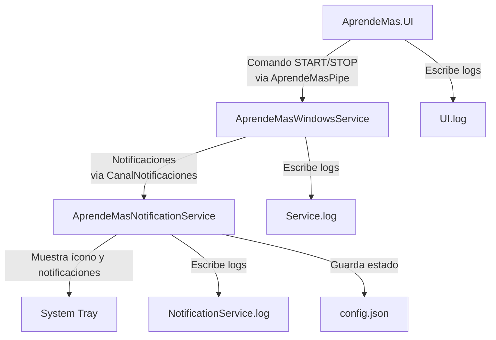

# Arquitectura de AprendeMasV2

## Diagrama de Componentes

## Explicación

- **AprendeMas.UI**: Envía comandos (`START`, `STOP`) al servicio a través de un named pipe (`AprendeMasPipe`).
- **AprendeMasWindowsService**: Procesa comandos y envía notificaciones al notificador via otro pipe (`CanalNotificaciones`).
- **AprendeMasNotificationService**: Recibe notificaciones, muestra un ícono en la bandeja del sistema, y guarda el estado en `config.json`.
- **Logs**: Cada componente genera logs en `C:\Program Files (x86)\Aprende Mas\[Componente]\Logs`.