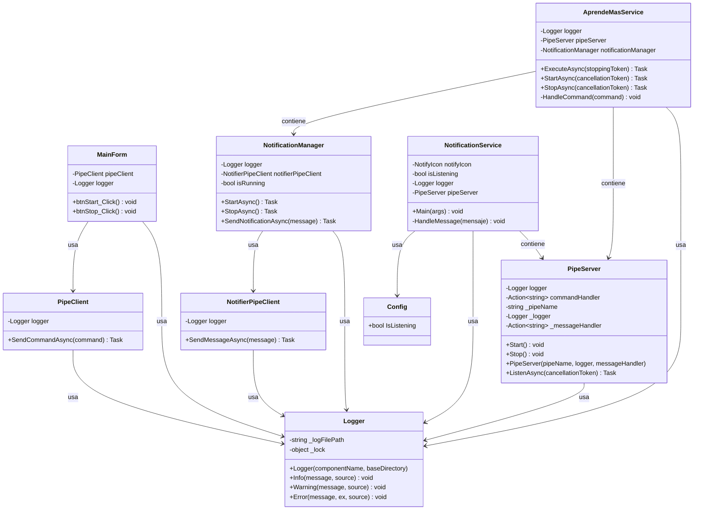

# Diagrama de Clases - AprendeMasV2

## Diagrama

## Explicación

- **AprendeMas.UI**:
  - `MainForm`: Interfaz gráfica que envía comandos (`START`, `STOP`) via `PipeClient`. Registra eventos con `Logger`.
  - `PipeClient`: Envía comandos al servicio a través del named pipe `AprendeMasPipe`.

- **AprendeMasWindowsService**:
  - `AprendeMasService`: Servicio de Windows que inicia `PipeServer` y `NotificationManager`. Procesa comandos y registra eventos.
  - `NotificationManager`: Gestiona notificaciones, enviándolas al notificador via `NotifierPipeClient`.
  - `PipeServer`: Escucha comandos en `AprendeMasPipe`.
  - `NotifierPipeClient`: Envía notificaciones al notificador via `CanalNotificaciones`.
  - `Logger`: Usado por todas las clases para registrar eventos en `[Componente].log`.

- **AprendeMasNotificationService**:
  - `NotificationService`: Clase estática que gestiona el ícono en la bandeja del sistema, escucha mensajes a través de `PipeServer` en el pipe `CanalNotificaciones`, y guarda el estado en `Config`.
  - `PipeServer`: Escucha mensajes asíncronamente en el pipe `CanalNotificaciones` y los procesa con un manejador de mensajes.
  - `Config`: Clase simple para serializar/deserializar el estado (`IsListening`) en `config.json`.

- **Relaciones**:
  - **Composición**: `AprendeMasService` contiene instancias de `NotificationManager` y `PipeServer`. `NotificationService` contiene una instancia de `PipeServer`.
  - **Dependencia**: `MainForm` depende de `PipeClient`, `NotificationService` depende de `PipeServer`, y casi todas las clases usan `Logger`.
  - **Uso**: `NotificationService` usa `Config` para persistir el estado.

## Notas

- Los logs se generan en `C:\Program Files (x86)\Aprende Mas\[Componente]\Logs`.
- Los pipes (`AprendeMasPipe`, `CanalNotificaciones`) son el núcleo de la comunicación.
- Clases no incluidas (por ejemplo, `WebSocketServer.cs`, `AudioConverter.cs`, `AudioTranscriber.cs`, `KeyboardSimulator.cs`, `MdnsServer.cs`) no están en el diagrama, ya que son placeholders sin implementación relevante.
