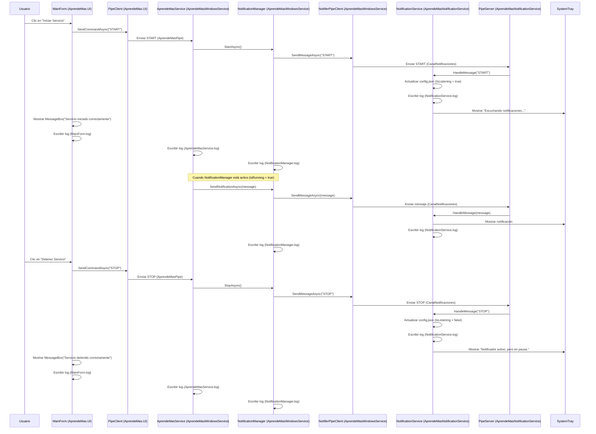

# Flujo de Notificaciones - AprendeMasV2

## Diagrama de Secuencia

## Explicación

1. El usuario hace clic en "Iniciar Servicio" en `MainForm` (UI).
2. `MainForm` usa `PipeClient` para enviar el comando `START` a `AprendeMasService` vía `AprendeMasPipe`.
3. `AprendeMasService` invoca `StartAsync` en `NotificationManager`, que usa `NotifierPipeClient` para enviar `START` a `NotificationService` vía `CanalNotificaciones`.
4. `NotificationService` procesa el comando con `HandleMessage`, actualiza `config.json` (`IsListening = true`), registra el evento en `NotificationService.log`, y muestra "Escuchando notificaciones..." en la bandeja del sistema.
5. `MainForm` muestra un `MessageBox` confirmando el éxito y registra el evento en `MainForm.log`. `AprendeMasService` y `NotificationManager` también registran eventos en sus respectivos logs.
6. Cuando `NotificationManager` está activo (`isRunning = true`), `AprendeMasService` puede enviar notificaciones vía `SendNotificationAsync`. Estas se envían a `NotificationService` a través de `CanalNotificaciones`, se muestran en la bandeja del sistema, y se registran en `NotificationService.log` y `NotificationManager.log`.
7. El usuario puede hacer clic en "Detener Servicio" en `MainForm`, lo que envía el comando `STOP` de manera similar, actualizando `config.json` (`IsListening = false`), mostrando "Notificador activo, pero en pausa." en la bandeja, y registrando eventos en los logs.

## Notas

- Los pipes (`AprendeMasPipe`, `CanalNotificaciones`) son unidireccionales y manejan la comunicación entre componentes.
- Los logs se generan en `C:\Program Files (x86)\Aprende Mas\[Componente]\Logs` con nombres específicos por clase (por ejemplo, `MainForm.log`, `AprendeMasService.log`, `NotificationService.log`).
- Los errores (por ejemplo, fallos de conexión al pipe) se manejan en cada componente, registrándose en los logs y mostrando mensajes al usuario cuando corresponde (por ejemplo, `MessageBox` en la UI).
- Clases como `AudioConverter`, `AudioTranscriber`, `KeyboardSimulator`, `MdnsServer`, y `WebSocketServer` no están incluidas, ya que son placeholders para futuras implementaciones.
