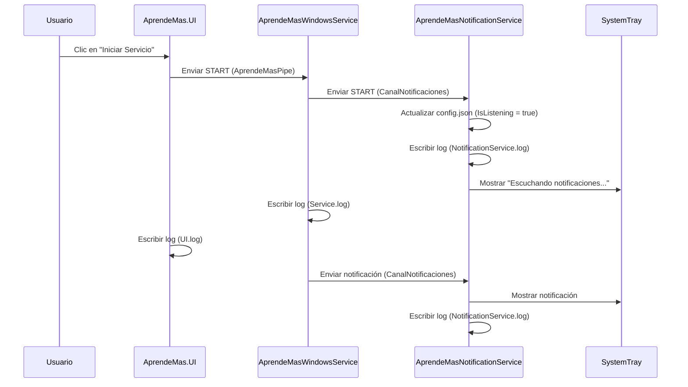

# Flujo de Notificaciones - AprendeMasV2

## Diagrama de Secuencia

## Explicación

1. El usuario hace clic en "Iniciar Servicio" en la UI.
2. La UI envía el comando `START` al servicio via `AprendeMasPipe`.
3. El servicio envía `START` al notificador via `CanalNotificaciones`.
4. El notificador actualiza `config.json`, registra el evento, y actualiza el ícono.
5. Cuando el servicio envía una notificación, el notificador la muestra en la bandeja del sistema.